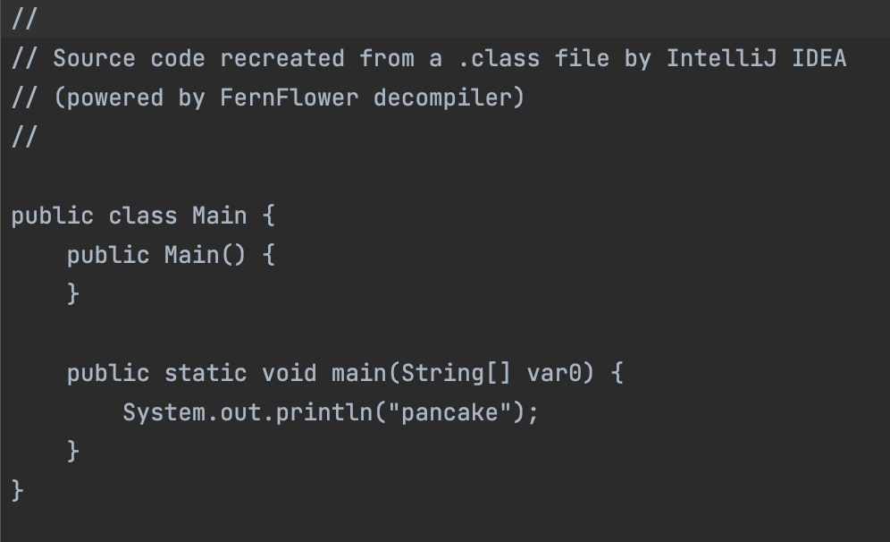
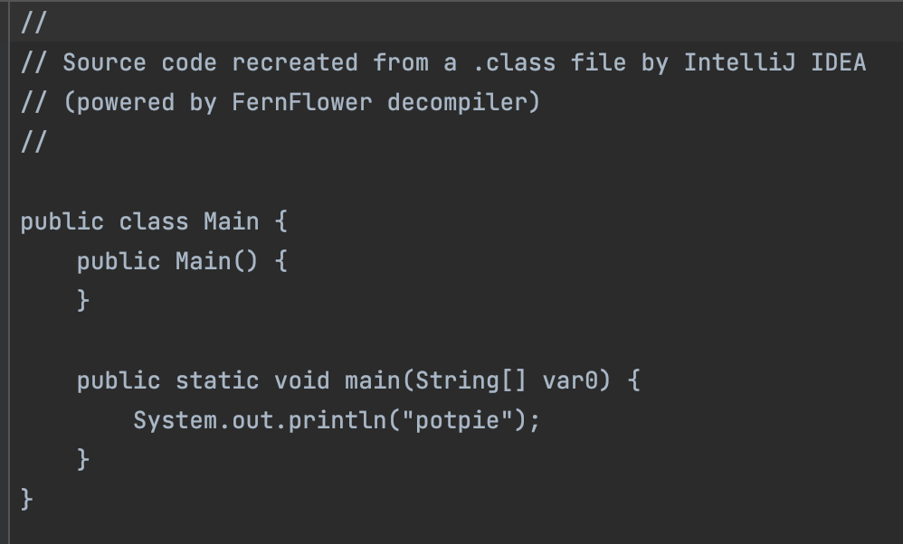

# 톱레벨 클래스는 한 파일에 하나만 담으라

## 요약

    소스 파일 하나에 톱레벨 클래스를 여러 개 선언하더라도 자바 컴파일러는 불평하지 않는다.
    하지만 심각한 문제를 일으키니 하면 안된다.


## 톱레벨 클래스란?
Apple의 공식 문서에 따르면 톱-레벨의 정의는 다음과 같다.

    Any executable statement not written within a function body, 
    within a class, or otherwise encapsulated is considered top-level.

함수, 클래스 또는 다른 무언가로 감싸지지 않은 모든 구문은 톱-레벨로 간주된다. 

즉, 톱레벨 클래스란 중첩 클래스가 아닌 것을 말한다.

## 코드 구성
``` java
// Main.java
public class Main {

    public static void main(String[] args) {
        System.out.println(Utensil.NAME + Dessert.NAME);
    }
}
```
``` java
// Utensil.java
class Utensil {
    static final String NAME = "pan";
}

class Dessert {
    static final String NAME = "cake";
}
```
``` java
// Dessert.java
class Utensil {
    static final String NAME = "pot";
}

class Dessert {
    static final String NAME = "pie";
}
```

## 문제 발생

### 컴파일 에러

`javac Main.java Dessert.java`


컴파일 에러가 나도 각 클래스를 중복해서 정의했다고 알려준다.

그 이유는 컴파일러는 다음과 같은 순서로 작동했기 때문이다.

1. 먼저 `Main.java` 컴파일
2. 그 안에서 `System.out.println(Utensil.NAME + Dessert.NAME);` 구문을 만나기 때문에 `Utensil.java`를 컴파일
3. 2번째 인수로 넘어온 `Dessert.java`을 컴파일 하려고 할 때 같은 클래스가 이미 정의되어 있는 것을 알게된다.

<br>

### Pancake 출력

`javac Main.java or javac Main.java Utensil.java`



<br>

### Potpie 출력
`javac Dessert.java Main.java`




## 해결책

### 톱레벨 클래스들을 서로 다른 소스 파일로 분리

``` java
// Utensil.java
public class Utensil {
    static final String NAME = "pan";
}
```
``` java
// Dessert.java
public class Dessert {
    static final String NAME = "cake";
}
```


### 톱레벨 클래스를 굳이 한 파일에 담고 싶을 때
[맴버 클래스는 되도록 static으로 만들어라(아이템 24) By 연로그](https://github.com/woowacourse-study/2022-effective-java/blob/main/04%EC%9E%A5/%EC%95%84%EC%9D%B4%ED%85%9C_24/%EB%A9%A4%EB%B2%84%20%ED%81%B4%EB%9E%98%EC%8A%A4%EB%8A%94%20%EB%90%98%EB%8F%84%EB%A1%9D%20static%EC%9C%BC%EB%A1%9C%20%EB%A7%8C%EB%93%A4%EC%96%B4%EB%9D%BC.md)

``` java
public class Main {

    public static void main(String[] args) {
        System.out.println(Utensil.NAME + Dessert.NAME);
    }
    
    private static class Utensil{
        static final String NAME = "pan";
    }
    
    private static class Dessert{
        static final String NAME = "caks";
    }
}
```


## 결론
- 한 소스 파일안에 톱레벨 클래스를 하나만 만들자.
- 사실 여러 톱레벨 클래스를 만들어도 이점이 없다.
- 터미널을 통해서 javac 명령어를 이용하지 않으면 인텔리제이는 어떤 순서든 컴파일을 해주지 않는다.
